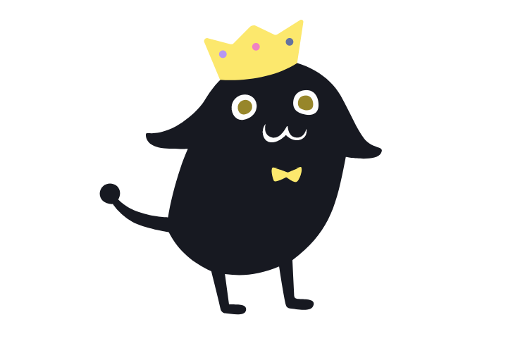
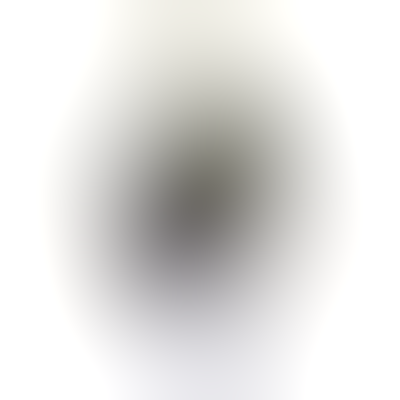

# blurhash

> Pure [Nim](https://nim-lang.org) implementation of [Blurhash](https://blurha.sh)

Blurhash is an algorithm written by [Dag Ågren](https://github.com/DagAgren) for [Wolt (woltapp/blurhash)](https://github.com/woltapp/blurhash) that encodes an image into a short (~20-30 byte) ASCII string. When you decode the string back into an image, you get a gradient of colors that represent the original image. This can be useful for scenarios where you want an image placeholder before loading, or even to censor the contents of an image [a la Mastodon](https://blog.joinmastodon.org/2019/05/improving-support-for-adult-content-on-mastodon/).

## Installation

`nimble install blurhash`

## Usage

Add `requires "blurhash"` to your `.nimble` file.

### Encoding

```nim
import blurhash, imageman/[images, colors]

let
  image = loadImage[ColorRGB]("image.png")
  hash = image.encode(5, 5)

echo hash
```

This snippet hashes following image into this compact string: `UrQ]$mfQ~qj@ocofWFWB?bj[D%azf6WBj[t7`



### Decoding

```nim
import blurhash, imageman/images

let image = "UrQ]$mfQ~qj@ocofWFWB?bj[D%azf6WBj[t7".decode[ColorRGBU](500, 500)

image.savePNG "blurred.png"
```

This results in following image:



## Other

Reference image author - https://rigani.me
